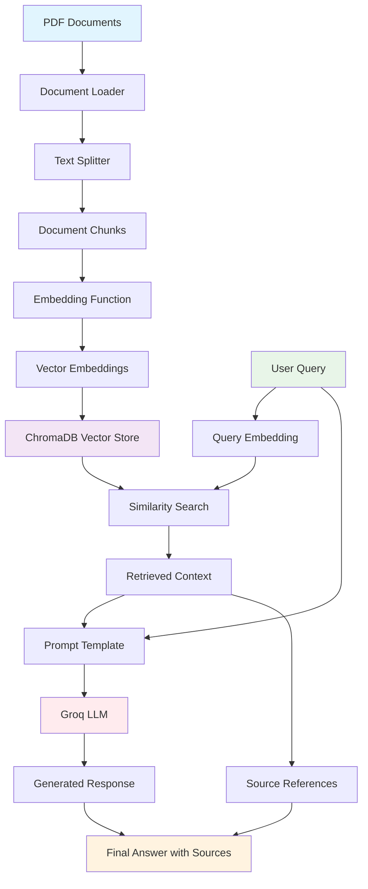

# RAG PDF System

A Retrieval-Augmented Generation (RAG) system for querying PDF documents using vector embeddings and large language models.

## System Architecture & Flow



## Component Overview

### 1. Document Processing Pipeline (`populate_database.py`)
- **PDF Loading**: Uses `PyPDFDirectoryLoader` to load PDF files from the `data/` directory
- **Text Splitting**: Implements `RecursiveCharacterTextSplitter` with:
  - Chunk size: 800 characters
  - Chunk overlap: 80 characters
- **Embedding Generation**: Converts text chunks to vector embeddings using HuggingFace's `all-MiniLM-L6-v2` model
- **Vector Storage**: Stores embeddings in ChromaDB with unique chunk IDs (format: `source:page:chunk_index`)

### 2. Query Processing Pipeline (`query_data.py`)
- **Query Embedding**: Converts user query to vector embedding using the same embedding model
- **Similarity Search**: Retrieves top 5 most similar document chunks from ChromaDB
- **Context Assembly**: Combines retrieved chunks into contextual information
- **Response Generation**: Uses Groq's LLM (`meta-llama/llama-4-scout-17b-16e-instruct`) to generate answers
- **Source Attribution**: Returns response with source references

### 3. Embedding Function (`get_embedding_function.py`)
- Provides consistent embedding functionality across the system
- Uses HuggingFace's `sentence-transformers/all-MiniLM-L6-v2` model
- Ensures semantic similarity matching between queries and documents

### 4. Testing Framework (`test_rag.py`)
- Automated testing of RAG responses
- Uses LLM-based evaluation to validate answer quality
- Compares actual responses against expected answers

## Data Flow

1. **Ingestion Phase**:
   ```
   PDF Files → Text Extraction → Chunking → Embedding → Vector DB Storage
   ```

2. **Query Phase**:
   ```
   User Query → Query Embedding → Similarity Search → Context Retrieval → LLM Processing → Response Generation
   ```

## Key Technologies

- **Vector Database**: ChromaDB for persistent vector storage
- **Embeddings**: HuggingFace Sentence Transformers (`all-MiniLM-L6-v2`)
- **LLM**: Groq API with Llama models
- **Document Processing**: LangChain for PDF loading and text splitting
- **Framework**: Python with LangChain ecosystem

## Setup and Usage

### Prerequisites
- Python 3.12+
- Groq API key (set in `.env` file as `GROQ_API_KEY`)

### Installation
```bash
# Install dependencies using uv
uv sync
```

### Usage

1. **Populate the database with PDF documents**:
   ```bash
   python populate_database.py
   ```

   To reset the database:
   ```bash
   python populate_database.py --reset
   ```

2. **Query the system**:
   ```bash
   python query_data.py "Your question here"
   ```

3. **Run tests**:
   ```bash
   pytest test_rag.py
   ```

## Configuration

- **Chunk Size**: 800 characters (configurable in `populate_database.py`)
- **Chunk Overlap**: 80 characters
- **Similarity Search**: Top 5 results (k=5)
- **Vector Database Path**: `./chroma/`
- **Document Path**: `./data/`

## File Structure

```
rag-pdf/
├── data/                    # PDF documents directory
│   └── monopoly.pdf        # Sample PDF document
├── chroma/                 # ChromaDB vector database
├── populate_database.py    # Database population script
├── query_data.py          # Query processing script
├── get_embedding_function.py # Embedding function utility
├── test_rag.py           # Testing framework
├── pyproject.toml        # Project dependencies
└── README.md            # This file
```

## Features

- **Incremental Updates**: Only processes new documents, avoiding duplicates
- **Source Attribution**: Tracks and returns source references for answers
- **Persistent Storage**: ChromaDB provides persistent vector storage
- **Automated Testing**: LLM-based evaluation of response quality
- **Configurable Chunking**: Adjustable text splitting parameters
- **Environment Configuration**: Secure API key management via `.env` files